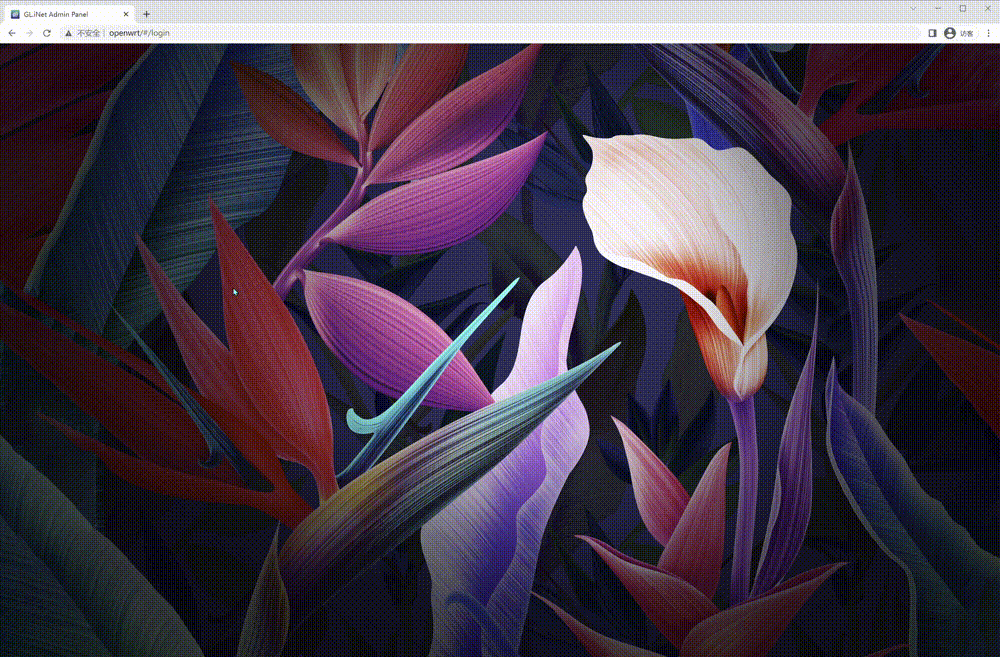
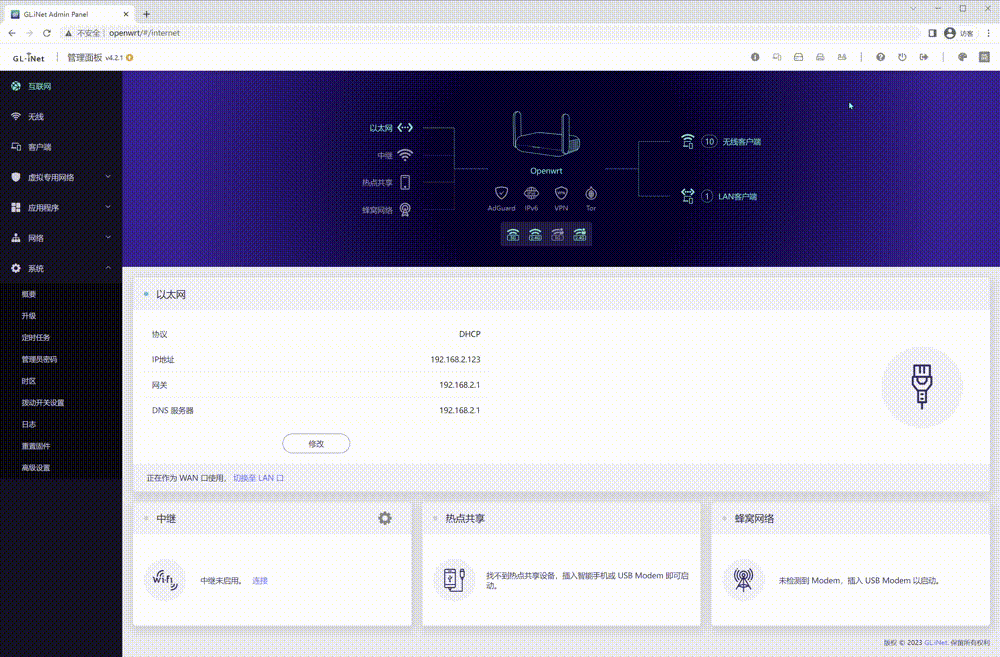
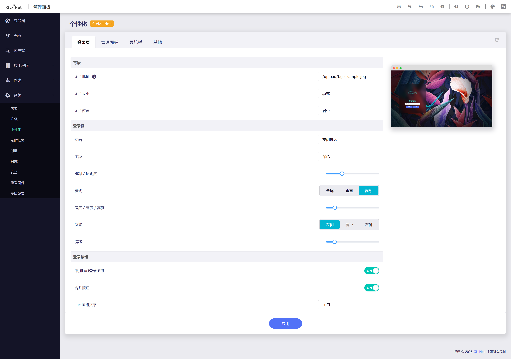
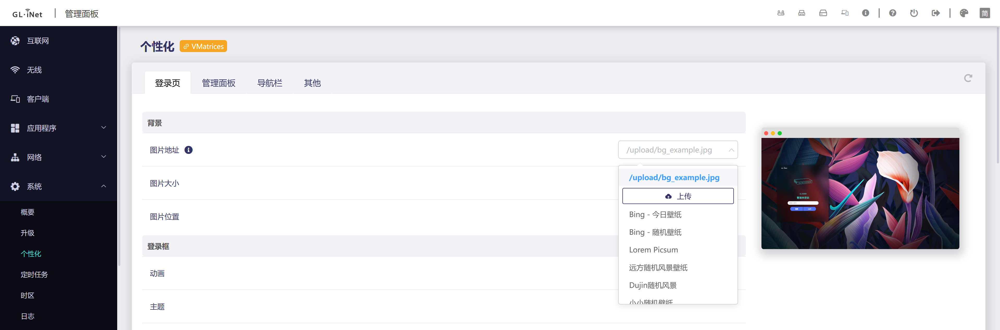
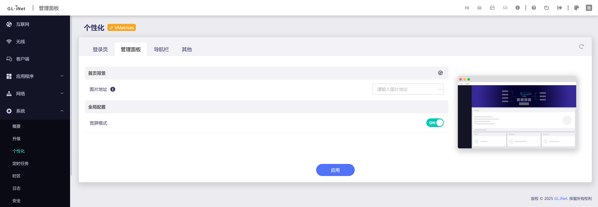
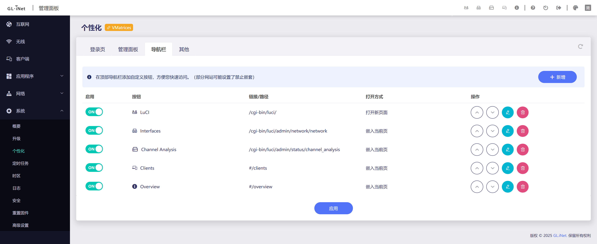
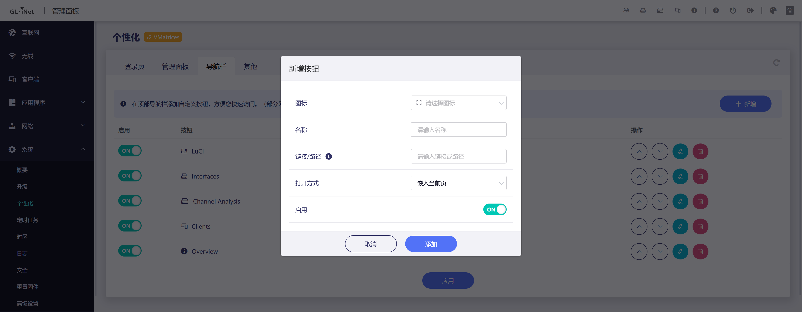
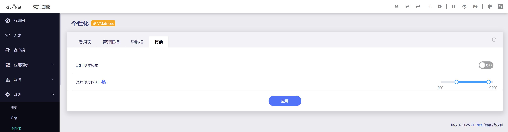

# GlInjector

GL-iNet 路由器UI增强插件。提供登录页美化、快捷按钮、自定义背景、风扇控制等功能。

> 原帖镜像：[forum.gl-inet.cn/forum.php?mod=viewthread&tid=3129](https://web.archive.org/web/20260120184234/https://forum.gl-inet.cn/forum.php?mod=viewthread&tid=3129&extra=page%3D1)（中文论坛已关闭）


## 功能一览

- **定制登录页** — 自定义背景图片（在线/上传）、浮动登录框、亮暗主题、登录框动画
- **一键登录 LuCI** — 登录页直接跳转 LuCI，自动维持会话免超时
- **自定义快捷按钮** — 顶部导航栏添加任意链接按钮，支持内嵌页面
- **宽屏模式** — 解除官方 UI 宽度限制，充分利用屏幕空间
- **首页背景** — 自定义首页背景图片，支持遮罩浓度调节
- **风扇温度区间** — 自定义 CPU 风扇起转和满转温度范围
- **移除区域限制** — 解除语言地区限制（仅供学习研究）

## 效果预览

| 登录页优化 | 自定义快捷按钮 |
|:---:|:---:|
|  |  |

## 配置界面

所有功能通过 **系统 → 个性化** 页面可视化配置，支持实时预览。

### 登录页

| 登录框样式配置 | 自定义壁纸来源 |
|:---:|:---:|
|  |  |

### 管理面板



### 导航栏

| 按钮列表管理 | 新增按钮 |
|:---:|:---:|
|  |  |

### 其他



## 兼容性

| 项目 | 说明 |
|:---|:---|
| 已验证型号 | MT2500/MT3000/B3000/BE3600/MT3600BE/MT6000，其他型号可自行测试 |
| 固件 | 4.7.0 及以上 |
| 架构 | 全部（all） |

> 固件版本低于 4.7.0 请使用 [旧版插件](https://github.com/VMatrices/glinjector/releases/tag/v3.0.2)

## 安装

1. 进入路由器管理页面
2. **系统 → 高级设置 → 本地文件 → 上传**
3. 选择 ipk 文件上传安装

按照返回官方UI: **系统 → 个性化**，点击 **应用** 按钮使配置生效。


## 配置说明

所有配置在 **系统 → 个性化** 页面完成：

- **登录页** — 背景、登录框样式、主题、动画、LuCI 按钮
- **管理面板** — 宽屏模式、首页背景
- **导航栏** — 新增/编辑/排序快捷按钮
- **其他** — 风扇温度区间、区域限制开关

修改后点击 **应用** 实时生效，支持 **恢复默认配置**。插件卸载后会自动还原还原相关文件为原始版本


## 项目结构

```
glinjector/
├── Makefile              # OpenWrt 构建脚本
├── files/
│   ├── config.conf       # UCI 配置文件
│   ├── menu.json         # OUI 注册菜单
│   ├── rpc.lua           # OUI RPC接口
│   ├── validator.lua     # OUI 参数校验
│   └── root/             # 系统覆盖文件
└── views/
    ├── src/                 # 管理页面
    ├── src_core/            # 核心注入脚本
    ├── src_dev/             # 本地调试项目
    ├── i18n/                # 国际化文件
    ├── vite.config.js       # 管理页面构建配置
    └── vite.config_core.js  # 核心脚本构建配置
```

## 构建

需要 OpenWrt SDK 环境，需额外安装 **Node.js**（用于前端构建）。

```bash
make package/glinjector/compile V=s
```

## 本地调试

支持在本地调试前端管理页面，前端采用Vue 2 + Element UI，相关组件文档可以参考 *gl-sdk4-ui.md* (未完成)

请在 `views/` 目录下创建 `.env` 文件（参考 `.env.example`）：

```
VITE_PROXY_TARGET=http://192.168.1.1/
VITE_GL_PASSWD=your_router_password
```

然后启动调试服务：

```bash
cd views
yarn run dev
```

## 国际化

| 语言 | 进度 |
|:---|:---:|
| 简体中文 (zh-cn) | 100% |
| 繁体中文 (zh-tw) | 95% |
| English (en) | 95% |
| 日本語 (ja) | 95% |

## 许可

GNU General Public License v3 (GPL v3)
